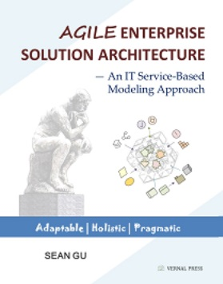

# Book: "Agile Enterprise Solution Architecture"

--- An IT Service-Based Modeling Approach

*By Sean Gu*

---

"Agile Enterprise Solution Architecture" (Agile **ESA**) presents an IT service-based enterprise solution architecture that **bridges the gap between traditional enterprise architecture and software design** in a holistic yet pragmatic modeling approach. It aims for ease of use and flexibility to better address uncertainties within a complex IT system and reduce the cost of change.

This book is written by and for the practitioners without finicky definitions. Exemplified with a walkthrough case study, the modeling framework offered here helps externalize various stakeholders' mental needs by correlating relevant architectural elements, placing functional services in the characterized containers (including cloud environment), and running through the optimal solutions. By leveraging the model's architectural-thinking mechanism, IT architects can explore solutions from both structural and decisional schools of thought to grasp real problems and progressively reshape the systems for a larger, ever-changing context.

This book focuses on service-based architecture, not on AI topics. However, *AI solution architecture* (ASA) also needs to incorporate the enterprise solution architecture modeling approach to enable adaptable enterprise AI. The book includes a list of AI-specific elements defined at the ESA abstraction level, and a link to the author's AI solution architecture (ASA), which covers approaches, model specifications, and examples. *AI assists solution architecture, while the architect oversees it*. In many enterprise settings, the complex solutions you own, govern, or host require far more than AI agents or a cross-cutting cognitive layer. Even an AI solution ecosystem depends heavily on its underlying solution architecture unless it's fully autonomous. Without a clear ESA model, it is difficult, if not impossible, for human architects to understand and govern complex, integrated solutions, whether they are AI-generated or AI-assisted.

### Purchase Links

- [amazon.com](https://www.amazon.com/dp/B09FL5Q8XC)

- [abebooks.com](https://www.abebooks.com/servlet/SearchResults?isbn=0578830973&clickid=X-xR5:TzwxyLUbdwUx0Mo36dUkBxaqwxLTnvzs0&cm_mmc=aff-_-ir-_-64613-_-77416&ref=imprad64613&afn_sr=impact)

- [betterworldbooks.com](https://www.betterworldbooks.com/product/detail/Agile-ENTERPRISE-SOLUTION-ARCHITECTURE--An-IT-Service-Based-Modeling-Approach-9780578830971)

### Book's Blog Site

- [a-esa.com](https://www.a-esa.com)

### Related ESA Links

The ESA is a concrete modeing approach, supported by practical element specifications. It's a **unified architectural model** with multiple profile modes from common viewpoints, including EA (enterprise architecture), BA (business architecture), Infra (infrastructure architecture), SWA (software architecture), SWD (UML-like software design), AI (AI solution architecture), integration architecture, and scalability architecture. It also offers a *lean mode* for quick adoptation. Here are some of the ESA site links:

- [Enterprise Solution Architecture (ESA) Element Specifications](https://seniorgu.github.io/esa/)
- [AI Solution Architecture (ASA) Model Specification](https://seniorgu.github.io/ai-esa/)
- [AI Solution Architecture (ASA) Architectural Approach](https://seniorgu.github.io/aisa/)
- [ESA Online Modeling Tool](https://diagram.a-esa.com)
